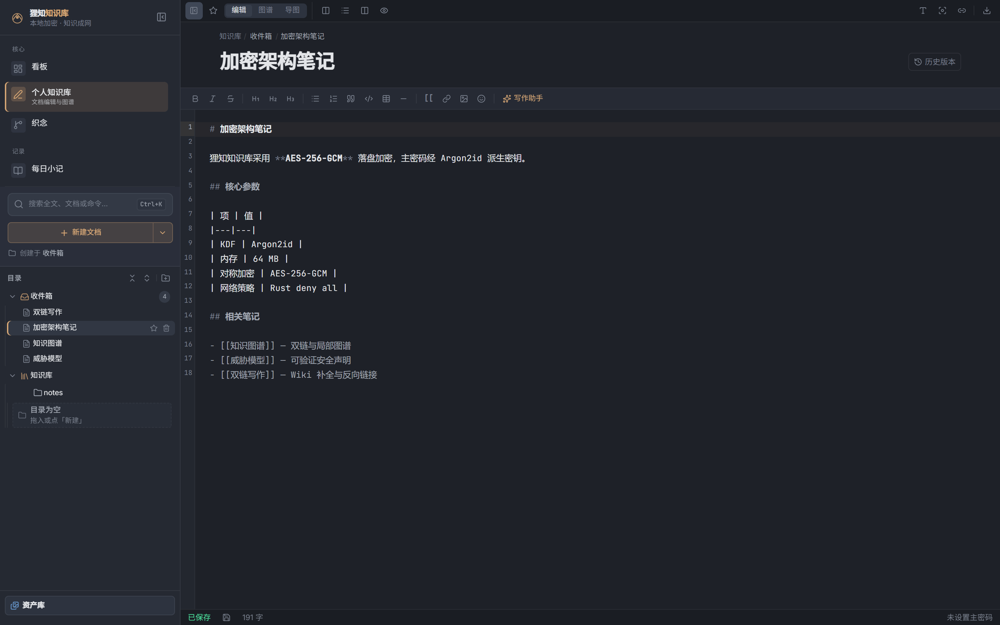
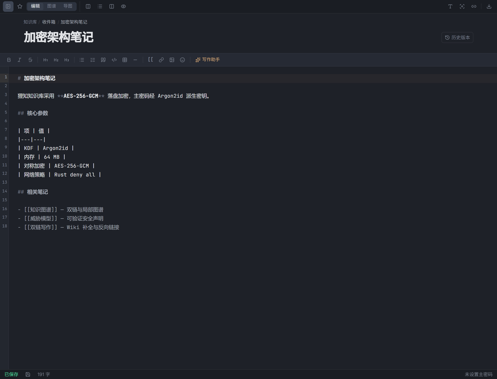
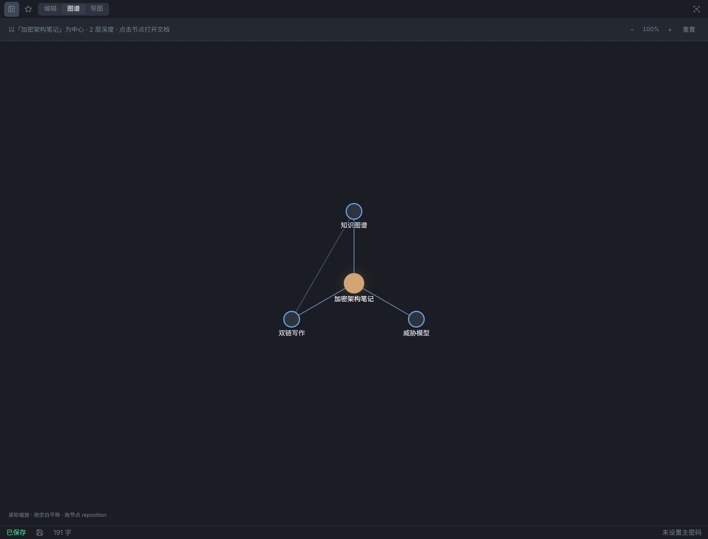
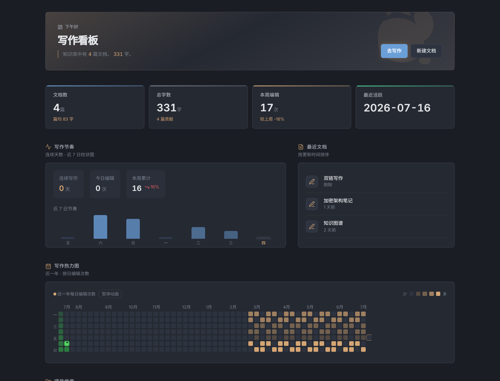
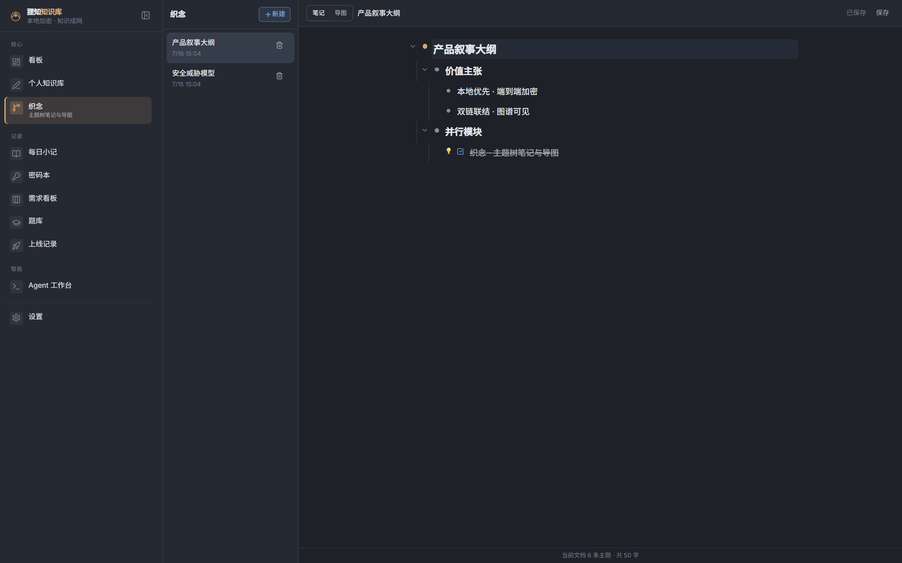
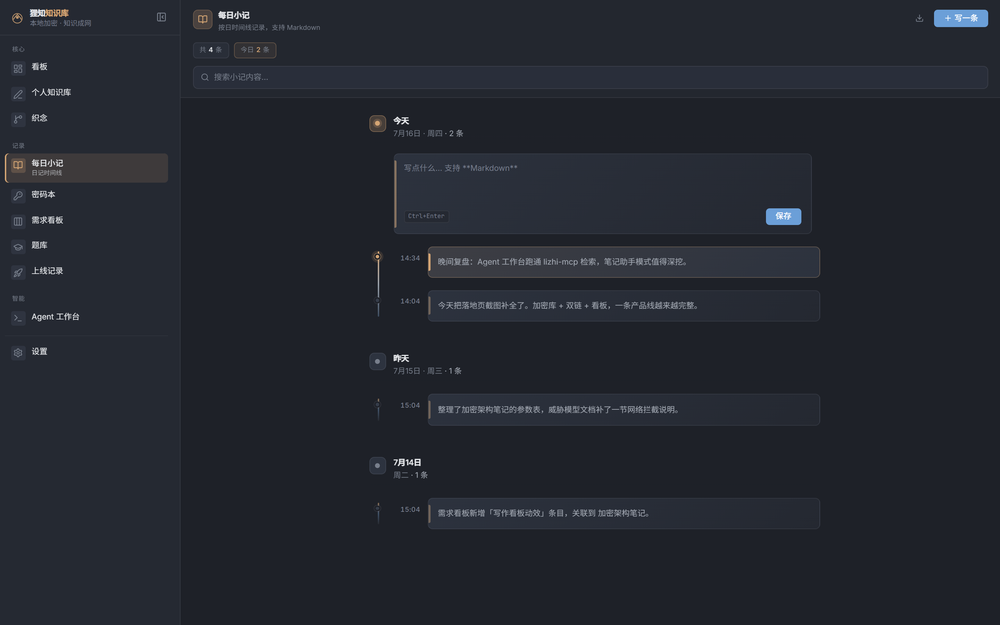
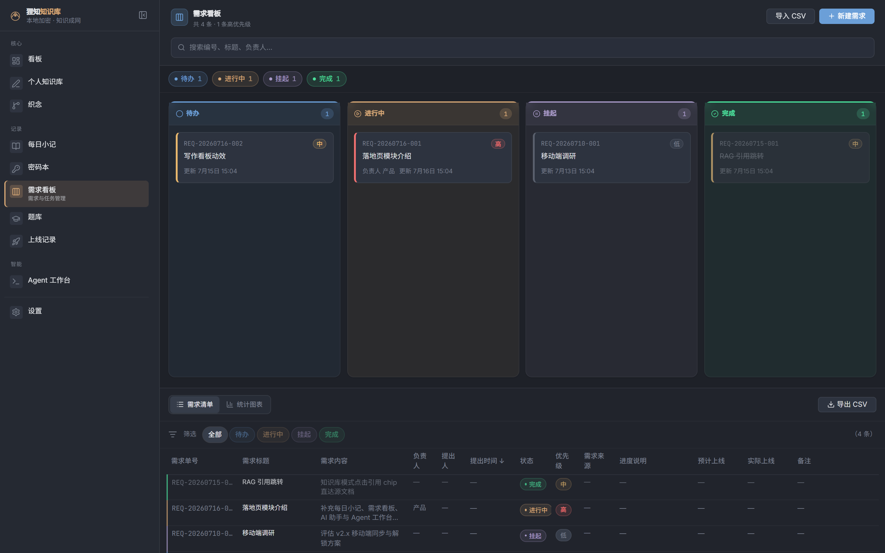
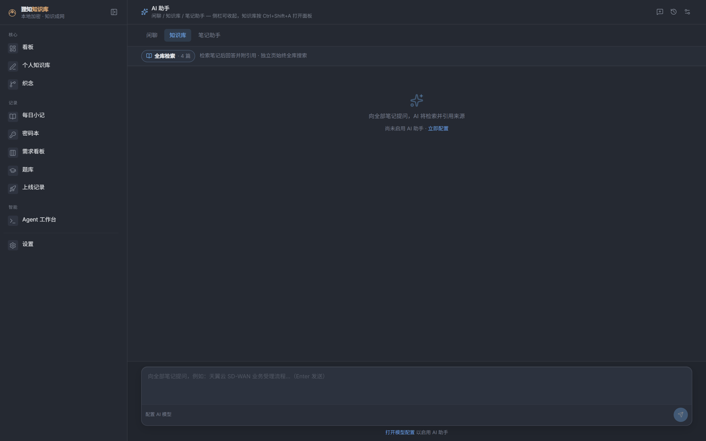
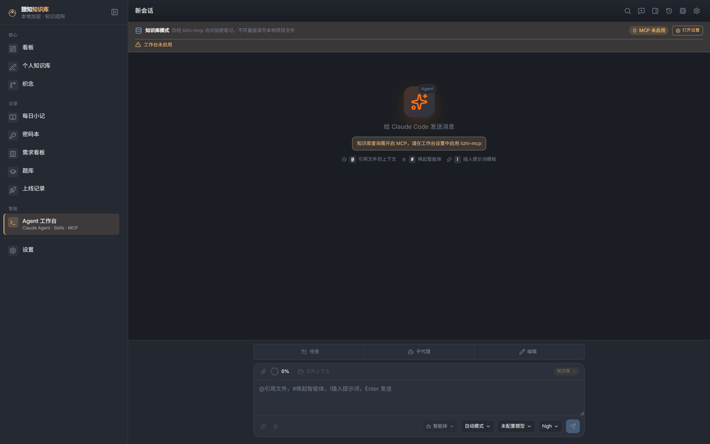

# 狸知知识库 · Lizhi Knowledge

> **你的加密知识库，猫一样安静。**  
> *Think in your nest. Link your knowledge.*

本地优先、端到端加密的**个人知识库**桌面应用。双链联结知识，图谱看见结构。默认零网络——可在 Wireshark 下验证。

[](https://github.com/DuebassLei/lizhi-kb/releases)

**[免费下载](https://github.com/DuebassLei/lizhi-kb/releases)** · **[产品落地页](https://duebasslei.github.io/lizhi-kb/)** · [完整产品设计](./docs/superpowers/specs/2026-07-06-lizhi-kb-complete-design.md)

<p align="center">
  
</p>

| AES-256-GCM 落盘加密 | 默认 0 网络请求 | Argon2id · 64 MB | 永久免费 ¥0 |
|:---:|:---:|:---:|:---:|

---

## 私密如猫，知识成网

加密、联结、防窥——三层能力叠加，构成狸知的完整护城河。

### 01 · 落盘即加密，解锁才明文

所有笔记以 **AES-256-GCM** 加密存储。主密码经 **Argon2id** 派生密钥。锁定后内存中的密钥与明文主动清零。

`KDF Argon2id` · `MEM 64MB` · `CIPHER AES-256`

### 02 · 双链呼吸，图谱可见

输入 `[[` 自动补全，反向链接实时更新。局部图谱以力导向布局呈现 2 层深度联结。

`WIKILINK <50ms` · `GRAPH ≥55fps`

### 03 · 界面水印，导出溯源

Canvas 覆盖层防旁人瞟屏。PDF 导出可强制嵌入水印，元数据自动清洗——无 Author、无 EXIF。

`WATERMARK ON` · `METADATA STRIPPED`

---

## 从写作到洞察，一条链路

| | |
|---|---|
| **专注写作** — CodeMirror 6 源码编辑 + 实时预览，打字机模式、自动保存 |  |
| **双链联结** — Wiki 双链 + 拼音搜索，反向链接与悬浮预览 |  |
| **局部图谱** — 从任意节点展开 2 层网络，SVG 力导向 ≥ 55fps |  |
| **写作洞察** — GitHub 风格热力图、链接统计、编辑活动 |  |

---

## 不止知识库，多条并行入口

织念、每日小记、需求看板、AI 助手与 Agent 工作台——与加密知识库**并列**，数据同库、路由独立。

### 织念 · `/mubu`

主题树笔记与导图双视图。大纲式展开思绪，一键切到导图看见结构——与 Markdown 知识库解耦，独立成篇、独立备份。

- 笔记视图：折叠、待办、标题级别与主题装饰
- 导图视图：同源切换，双击改标题，导出 PNG / Markdown
- 独立数据表，纳入 `.lizhi` 备份（`merge-documents` 按篇合并）

<p align="center">
  
</p>

### 每日小记 · `/journal`

日记式记录，与普通文档流分离的日常入口。按日时间线分组，快速捕捉灵感，支持 Markdown 与导出。

- 时间线按日折叠，今天与历史一目了然
- Ctrl+Enter 快速提交，不打断写作心流
- 独立 journal 数据表，纳入 `.lizhi` 备份

<p align="center">
  
</p>

### 需求看板 · `/requirements`

需求从提出到完成的工作流。Kanban 四列拖拽、优先级与负责人、可关联知识库文档。

- 待办 / 进行中 / 挂起 / 完成四列看板
- REQ 编号、提出人、预计上线时间
- 关联文档、CSV 导入导出

<p align="center">
  
</p>

### 灵狸 AI 助手 · `/ai`

本地加密、**opt-in 外联**。Ollama 本地优先，可选云端 OpenAI 兼容 API。闲聊、知识库 RAG、笔记助手三模式——工作区侧栏（`Ctrl+Shift+A`）或独立全页。

- 知识库模式：FTS5 检索 + 引用跳转源文档
- 笔记助手：搜索 / 阅读 / 写入笔记（需显式开启）
- 默认零网络；云端与写笔记均需 opt-in 确认

<p align="center">
  
</p>

### Agent 工作台 · `/cc-workbench`

基于 Claude Agent SDK 的独立控制平面。Agents · Skills · MCP 编排，vault / project 双工作目录——**与应用内 AI 助手并列，互不合并**。

- 知识库模式：仅 lizhi-mcp，安全访问加密库
- 项目模式：完整文件工具 + Bash，本地项目开发
- 会话回放、进程管理、提示词与斜杠命令

<p align="center">
  
</p>

> **并列不合并** — AI 助手负责应用内对话与 RAG；Agent 工作台负责长链路智能体任务。两者共享本地优先叙事，路由与运行时独立。

---

## 知识网络 × 本地加密

| 能力 | 狸知 | Obsidian | Standard Notes | Notion |
|------|:----:|:--------:|:--------------:|:------:|
| 本地加密落盘 | ✓ | — | ✓ | — |
| 双链 + 图谱 | ✓ | ✓ | — | 部分 |
| 零网络默认 | ✓ | — | 部分 | — |
| 界面/导出水印 | ✓ | — | — | — |
| 元数据清洗导出 | ✓ | 部分 | 部分 | — |

狸知是唯一在「知识网络化」与「可验证本地加密」两个维度同时拉满的个人知识库。

---

## 可验证的安全，不是口号

我们不说「绝对无法破解」。我们说得出每一项参数，查得到每一次网络拦截。

| 参数 | 值 |
|------|-----|
| KDF | Argon2id |
| KDF 内存 | 64 MB |
| 对称加密 | AES-256-GCM |
| 盐长度 | 32 bytes |
| 网络策略 | Rust deny all |
| 漏洞披露 | security@lizhi.app |

---

## 完全免费，全功能开放

不设付费墙、不设订阅、不设功能阉割。加密、双链、图谱、App Lock、水印、PDF 导出、织念、每日小记、需求看板、AI 助手、Agent 工作台——**全部免费**，Win / macOS / Linux 均可下载。

---

## 常见问题

**狸知是 Obsidian 插件吗？**  
不是。狸知是独立桌面应用（Tauri + Rust），从存储层实现加密。

**真的零网络吗？**  
默认 Rust 层拦截所有出站连接。设置页可查看实时拦截计数。更新需手动下载。

**忘记主密码怎么办？**  
凭恢复密钥可重置。无恢复密钥则无法解密——这是加密的设计使然。

**能导入 Obsidian 库吗？**  
支持导入 Markdown 文件夹，保留 `[[双链]]` 语法。

**v1.x 有移动端吗？**  
仅桌面端。移动端在路线图中，暂无日期。

**源码可以商用吗？**  
桌面应用免费使用。源码非宽松开源协议；商用、二次分发或修改发布需事先邮件联系作者 [1130122701@qq.com](mailto:1130122701@qq.com) 取得书面授权。

---

## 源码授权与联系作者

狸知知识库**桌面应用永久免费**使用。源码托管于 GitHub 供学习与交流参考，**非 MIT 等宽松开源协议**。完整条款见仓库根目录 **[LICENSE](./LICENSE)**。

| 场景 | 说明 |
|------|------|
| 个人学习 / 研究 / 自用 | 允许 |
| 商用、二次分发、修改发布 | 需事先获得**作者书面授权** |
| 嵌入其他产品或 SaaS | 需事先获得**作者书面授权** |

**作者邮箱**：[1130122701@qq.com](mailto:1130122701@qq.com)  
**GitHub**：[DuebassLei/lizhi-kb](https://github.com/DuebassLei/lizhi-kb)

<p align="center">
  
  <br />
  <sub>扫码关注公众号 · 海边的小鱼干 · 获取更新与作者动态</sub>
</p>

---

## 开发

技术栈：**Tauri 2** · **Rust** · **Vue 3** · **Pinia** · **Tailwind CSS 4**

### 前置要求

- [Node.js](https://nodejs.org/) 20+
- [pnpm](https://pnpm.io/)
- [Rust](https://www.rust-lang.org/tools/install)（`pnpm tauri dev` / 打包需要）

**Windows（SQLCipher / OpenSSL）**：默认 `sqlcipher` feature 需 OpenSSL Dev 版。

1. 安装 [Visual Studio Build Tools](https://visualstudio.microsoft.com/visual-cpp-build-tools/)（「使用 C++ 的桌面开发」）
2. `winget install ShiningLight.OpenSSL.Dev`
3. 复制 `src-tauri/.cargo/config.toml.example` → `config.toml`，或设置 `OPENSSL_DIR` / `OPENSSL_LIB_DIR`

快捷脚本：`.\scripts\setup-windows-build.ps1 -TauriDev`。本地调试可回退：`cargo build --no-default-features --features plain-sqlite`（vault 无加密）。

### 常用命令

```bash
pnpm dev              # 仅前端（浏览器预览，无需 Rust）
pnpm tauri dev        # 完整桌面应用
pnpm verify           # 前端 + MCP + Rust 零警告门禁
pnpm test:e2e         # Playwright E2E
pnpm capture:landing  # 重新生成落地页 / README 截图
```

### 打包与发版

```powershell
pnpm tauri build
# 产物：src-tauri/target/release/bundle/msi/*.msi、nsis/*.exe
```

多平台 CI：[`.github/workflows/build-release.yml`](.github/workflows/build-release.yml)。推送 `v*` 标签后三平台并行构建，产物出现在 [Releases](https://github.com/DuebassLei/lizhi-kb/releases)。

**产品落地页**：[`website/`](website/) · GitHub Pages 工作流 [`.github/workflows/pages.yml`](.github/workflows/pages.yml)

### 路由（产品 IA）

| 路由 | 说明 |
|------|------|
| `/welcome` | FTUE 首次引导 |
| `/unlock` | 解锁层 |
| `/insights` | 写作看板（默认首页） |
| `/workspace` | 个人知识库（编辑 / 图谱 / 导图为视图切换） |
| `/journal` | 每日小记 |
| `/requirements` | 需求看板 |
| `/ai` | 灵狸 AI 助手 |
| `/cc-workbench` | Agent 工作台 |
| `/mubu` | **织念**（主题树笔记 / 导图） |
| `/question-bank` | 题库 |
| `/settings` | 设置 |

原型 `prototype/index.html` 仅作交互参考；实现以 [complete-design spec](./docs/superpowers/specs/2026-07-06-lizhi-kb-complete-design.md) 为准。

### 项目结构

```
lizhi-kb/
├── src/                  Vue 3 前端
├── src-tauri/            Tauri / Rust 后端
├── website/              产品落地页（GitHub Pages）
├── docs/                 产品设计、品牌、工作流
├── packages/             ai-bridge、lizhi-mcp
├── tests/e2e/            Playwright
└── AGENTS.md / CLAUDE.md Agent 入口
```

### 数据目录

用户数据：`~/.lizhi-kb/`（勿提交 Git）

```
~/.lizhi-kb/
├── vault.meta.json / keys.enc / vault.db
├── workspace/            Markdown 正文（.md 或 .md.enc）
├── assets/               图片等资源
├── revisions/            文档历史版本
├── vault-ui-state.json   UI 状态 SSOT
├── ai-config.json / ai-secrets.json(.enc)
├── cc-workbench.json / cc-secrets.json(.enc)
└── mcp-config.json
```

**备份**：设置 → 备份与恢复 → `.lizhi` 压缩包（format v2）。详见 [备份设计](./docs/design/2026-07-08-backup-extension.md)。

---

## 文档

| 文档 | 路径 |
|------|------|
| **产品设计（SSOT）** | [complete-design](./docs/superpowers/specs/2026-07-06-lizhi-kb-complete-design.md) |
| **品牌与 UI** | [lizhi-brand-design](./docs/brand/lizhi-brand-design.md) |
| **落地页文案** | [product-landing-page](./docs/design/product-landing-page.md) |
| Agent 工作台 | [cc-workbench-design](./docs/superpowers/specs/2026-07-10-cc-workbench-design.md) |
| AI 对话 | [lizhi-ai-chat-design](./docs/superpowers/specs/2026-07-08-lizhi-ai-chat-design.md) |
| MCP 集成 | [lizhi-mcp-design](./docs/superpowers/specs/2026-07-08-lizhi-mcp-design.md) |
| Agent 工作流 | [docs/agent-workflow/](./docs/agent-workflow/README.md) |

---

## 版本路线

| 版本 | 代号 | 重点 |
|------|------|------|
| v1.0 | Vault | 加密库、编辑器、热力图 |
| v1.5 | Network | 双链、图谱、App Lock、水印 |
| v1.6+ | 灵狸 AI | 应用内 AI 助手（三模式） |
| v1.7+ | Agent 工作台 | Claude Agent SDK（已落地） |
| v2.0 | Shadow | 诱饵库、盲水印、加密核心审计公开 |

---

<p align="center">
  <sub>© 狸知知识库 · Lizhi Knowledge · <a href="./LICENSE">作者授权协议</a> · 联系 <a href="mailto:1130122701@qq.com">1130122701@qq.com</a></sub>
</p>
