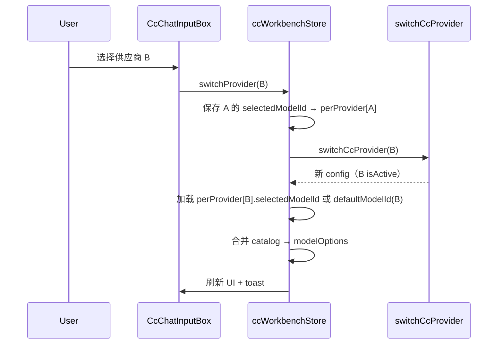

# CC 工作台 · 输入栏模型与供应商切换设计

**文档版本**：v1.1.0  
**更新日期**：2026-07-13  
**状态**：已实现  
**关联**：[2026-07-10-cc-workbench-design.md](./2026-07-10-cc-workbench-design.md)

---

## 1. 背景与目标

CC 工作台输入框底部已有**权限模式**、**模型**、**effort** 下拉，但存在明显缺口：

| 问题 | 现状 |
|------|------|
| 模型列表过短 | `buildModelOptions()` 仅合并供应商三槽位并去重，同一 ID 只显示一行 |
| 无法快速换供应商 | 切换需进入设置 → 供应商 Tab |
| 无 1M 上下文控制 | 仅检测 `[1m]` 后缀，无独立开关 |
| 自定义模型无统一入口 | 无「添加模型」与设置页同步 |

**目标**：对齐 jetbrains-cc-gui 输入栏体验，在 **CcChatInputBox 底栏** 实现：

1. **供应商切换** — 列出已配置供应商，一键激活  
2. **可扩展模型列表** — 内置目录 + 自定义 + 最近使用 + 供应商槽位  
3. **1M 上下文开关** — 对支持 1M 的模型动态附加/移除 `[1m]` 后缀  
4. **设置页同步** — 自定义模型在 CC 设置中可查看与管理，与 chat prefs SSOT 一致  

**范围（v1）**：

- 仅 Claude Agent SDK 路径（现有 CC 工作台）  
- 复用 `switchCcProvider`、`testCcModel`、`activateProvider` 等已有能力  
- 不做 Codex/Gemini、远程拉取模型 API、设置页供应商大重构  

---

## 2. 方案选型

| 方案 | 做法 | 结论 |
|------|------|------|
| **A（采用）** | `CcProviderSelect` + `ccModelCatalog` + `useCcModelCatalog`，改动集中在 chat 与 store | ✅ 2–3 天可交付，最小 diff |
| B | 抽出 `CcInputToolbar.vue` 统一管理 | 抽象收益有限，v1 不做 |
| C | 自定义模型写入 Rust 供应商配置 | 过重，违背「会话内快速切换」 |

---

## 3. UI 布局

底栏控件顺序（对齐 CC GUI）：

```
[✨ 增强] [⚡ 思考]  |  [权限模式 ▾] [供应商 ▾] [模型 ▾] [effort ▾]  |  [发送]
```

### 3.1 供应商下拉 `CcProviderSelect`

- **数据源**：`config.providers`（`name` + 当前激活 ✓）  
- **交互**：点击 → `switchProvider(id)`（LOCAL settings 仍走确认流程，复用 `activateProvider` 逻辑）  
- **状态**：切换中禁用 + loading；成功/失败 toast  
- **样式**：名称超长 `truncate`；`title` 显示完整名称与模式（official/custom/local）  

### 3.2 模型下拉（增强现有）

分组顺序（组内按 label 排序）：

1. **最近使用** — 当前供应商，最多 5 个  
2. **自定义** — 当前供应商的 `customModels`  
3. **推荐模型** — 内置 Claude 目录（`ccModelCatalog.ts`）  
4. **供应商槽位** — Sonnet / Opus / Haiku 角色标签（即使 ID 相同也保留角色行）  

底部操作区：

- **1M 上下文** — Switch（见 §5）  
- **+ 添加自定义模型** — 小弹窗：模型 ID（必填）+ 别名（可选）  

保留现有「模型可用性 / 测试」与 20s 超时逻辑；下拉使用 Teleport + fixed 定位（已实现，沿用）。

### 3.3 设置页同步区块

在 `CcWorkbenchSettingsShell` → **供应商 Tab** 或独立 **模型** 子区块增加：

- **按供应商展示**自定义模型列表（只读 ID + 别名 + 删除）  
- **添加**入口与输入栏弹窗共用 `useCcModelCatalog`  
- 变更通过 `CustomEvent('cc-model-catalog-change')` 或 composable 内 reactive store 同步到输入栏，无需刷新页面  

---

## 4. 数据模型

### 4.1 内置模型目录 `ccModelCatalog.ts`

静态列表，对齐 CC GUI 子集（可按版本迭代扩充）：

```ts
interface CcCatalogModel {
  id: string;           // 不含 [1m] 后缀
  label: string;
  description?: string;
  supports1m: boolean;  // !id.includes('haiku')
}
```

初始包含：`claude-opus-4-6`、`claude-sonnet-4-6`、`claude-haiku-4-5` 等；第三方供应商仍可选目录内任意 ID（API 决定是否可用）。

### 4.2 合并逻辑 `buildCcModelCatalog()`

```
最终列表 =
  ① customModels[providerId]
  ∪ ② recentModelIds[providerId]（最多 5，去重）
  ∪ ③ CLAUDE_CATALOG（静态）
  ∪ ④ 供应商三槽位（sonnet/opus/haiku，保留 slot 标签，同 ID 不合并不同 slot）
```

每项输出统一为 `CcChatModelOption` 扩展：

```ts
interface CcChatModelOption {
  slot?: CcModelSlot;      // 槽位来源时有值
  id: string;              // 含或不含 [1m]，见 §5
  baseId: string;          // strip1mSuffix(id)
  label: string;
  description: string;
  supports1m: boolean;
  source: 'recent' | 'custom' | 'catalog' | 'slot';
}
```

### 4.3 持久化 — 扩展 `cc-workbench-chat-prefs`

```ts
interface CcChatPrefs {
  // 现有
  selectedModelId: string;
  permissionMode: CcPermissionMode;
  reasoningEffort: CcReasoningEffort;
  disableThinking?: boolean;

  // 新增
  longContextEnabled: boolean;  // 全局 1M 开关偏好（默认 true，对齐 CC GUI）
  perProvider: Record<string, {
    selectedModelId: string;
    recentModelIds: string[];   // 最多 5
  }>;
  customModels: Record<string, Array<{
    id: string;       // baseId，不含 [1m]
    label?: string;
  }>>;
}
```

**迁移**：读取旧 prefs 时，`perProvider` / `customModels` / `longContextEnabled` 缺省为空对象 / `true`；`selectedModelId` 仍作为当前供应商的回退值。

### 4.4 供应商切换流程



切换后 toast：「已切换供应商，下一条消息使用新配置」。

---

## 5. 1M 上下文开关

对齐 CC GUI `ModelSelect` 底部 Switch 行为。

### 5.1 判定规则

```ts
function modelSupports1mContext(baseId: string): boolean {
  return !strip1mSuffix(baseId).toLowerCase().includes('haiku');
}
```

与现有 `modelSupports1m(id)`（检测后缀）职责分离：

- `modelSupports1mContext(baseId)` — 模型是否**支持** 1M  
- `modelSupports1m(id)` — 当前 ID **是否已启用** 1M（含 `[1m]` 后缀）  

### 5.2 开关行为

- 存储：`longContextEnabled: boolean`（prefs 级，非 per-model）  
- UI：模型下拉底部 Switch，文案「1M 上下文」  
- **disabled**：当前选中模型的 `baseId` 不支持 1M（如 Haiku）  
- **切换 ON**：`selectedModelId = apply1mSuffix(baseId, true)` → `claude-sonnet-4-6[1m]`  
- **切换 OFF**：移除 `[1m]` 后缀  
- **选择新模型**：若 `longContextEnabled && supports1m`，自动附加 `[1m]`  
- **contextWindow**：沿用 store 逻辑 — `modelSupports1m(selectedModelId) ? 1_000_000 : 200_000`  

### 5.3 发消息

`streamCcWorkbench` 传入的 `selectedModel` 为完整 ID（含 `[1m]` 若启用）；Rust/bridge 无需改动。

---

## 6. 自定义模型

### 6.1 添加（输入栏 / 设置页共用）

- 校验：非空、`id` 去首尾空格、同 provider 内 `baseId` 不重复  
- 写入 `customModels[providerId]`  
- 可选立即选中并 push 到 `recentModelIds`  

### 6.2 删除（设置页）

- 从 `customModels[providerId]` 移除  
- 若当前 `selectedModelId` 的 baseId 等于被删项 → 回退 `defaultModelId(provider)`  

### 6.3 同步机制

`useCcModelCatalog.ts` 作为 SSOT：

- `readPrefs()` / `writePrefs()` 封装 localStorage  
- `addCustomModel` / `removeCustomModel` / `pushRecent` / `getCatalogForProvider`  
- 变更后 `dispatchEvent(new CustomEvent('cc-model-catalog-change'))`  
- Store 与 Settings 均 subscribe，保证双向一致  

---

## 7. 文件级改动

| 文件 | 改动 |
|------|------|
| `src/utils/ccModelCatalog.ts` | **新建**：内置目录 + `buildCcModelCatalog` + 1M 工具函数 |
| `src/composables/useCcModelCatalog.ts` | **新建**：prefs 读写、custom/recent、事件同步 |
| `src/components/cc/chat/CcProviderSelect.vue` | **新建**：供应商下拉 |
| `src/components/cc/chat/CcAddModelDialog.vue` | **新建**：添加自定义模型弹窗 |
| `src/components/cc/chat/CcChatInputBox.vue` | 接入 Provider、增强 Model 菜单、1M Switch |
| `src/components/cc/settings/CcCustomModelsSection.vue` | **新建**：设置页自定义模型管理 |
| `src/components/cc/CcWorkbenchSettingsShell.vue` | 挂载 `CcCustomModelsSection` |
| `src/stores/ccWorkbench.ts` | `switchProvider`、`longContextEnabled`、per-provider prefs、catalog 集成 |
| `src/utils/ccChatModels.ts` | 保留 slot 解析；1M 工具迁移至 catalog 或 re-export |
| `src/composables/useCcWorkbenchSettings.ts` | 可选：暴露 `providers` 给 chat（或 store 直接读 config） |

**不改**：Rust IPC、`switchCcProvider` 签名、ai-bridge 模型测试协议。

---

## 8. Store API（新增/变更）

```ts
// ccWorkbench store
async function switchProvider(providerId: string): Promise<void>
function setSelectedModelId(id: string): void      // 含 recent push + 1M 后缀应用
function setLongContextEnabled(enabled: boolean): void
function addCustomModel(baseId: string, label?: string): void
function removeCustomModel(baseId: string): void

// computed
const providers: ComputedRef<CcProviderPublic[]>
const modelOptions: ComputedRef<CcChatModelOption[]>  // 来自 catalog 合并
const longContextEnabled: Ref<boolean>
```

`switchProvider` 内部复用 settings 的 LOCAL 确认逻辑（可提取 `activateCcProvider(id)` 到 shared composable 避免重复）。

---

## 9. 验收标准（v1.0.2 已实现）

### 9.1 供应商切换

- [x] 底栏显示当前激活供应商名称  
- [x] 下拉列出全部已配置供应商，当前项有 ✓  
- [x] 切换后模型列表、选中模型、测试缓存按新供应商更新  
- [x] LOCAL settings 供应商切换仍弹出确认  
- [x] 切换过程中下拉禁用，失败有 error toast  

### 9.2 模型列表

- [x] 三槽位同 ID 时仍显示 Sonnet/Opus/Haiku 三行（带角色描述）  
- [x] 内置目录模型可见并可选择  
- [x] 「+ 添加自定义模型」可添加并在列表「自定义」组展示  
- [x] 最近使用最多 5 个，切换模型后更新  
- [x] 模型可用性测试与 20s 超时仍正常工作  

### 9.3 1M 上下文

- [x] 模型下拉底部有 1M Switch  
- [x] Haiku 等不支持模型时 Switch 禁用  
- [x] 开启后 `selectedModelId` 带 `[1m]`，context 进度条按 1M 计算  
- [x] 关闭后移除后缀，发消息使用 base ID  
- [x] 偏好持久化，重启后恢复  

### 9.4 设置页同步

- [x] 设置 → CC 工作台可见当前供应商的自定义模型列表  
- [x] 设置页添加/删除与输入栏列表实时同步  
- [x] 删除当前选中模型时自动回退默认模型  

### 9.5 回归

- [x] 斜杠命令、@ 补全、权限模式、effort 下拉不受影响  
- [x] 输入触发符：`@` 引用文件、`#` 唤起智能体、`!` 插入提示词、`/` 行首斜杠命令（见 [工作台设计 §7.2](./2026-07-10-cc-workbench-design.md#72-输入触发符)）  
- [x] `pnpm verify:fe` 零 warning  

---

## 10. 风险与对策

| 风险 | 对策 |
|------|------|
| 切换供应商时会话仍绑定旧模型上下文 | 切换 toast 提示；不改历史消息 `modelLabel` |
| 自定义 ID 无效 | 可用性测试标 ✗，不阻止选择 |
| 底栏控件过多 | 供应商/模型名 truncate；小屏 effort 可后续折叠 |
| prefs 结构升级 | 读取时缺字段给默认值，不写破坏性迁移 |
| 1M 与第三方网关 | 第三方若不支持 `[1m]` 后缀，测试失败可见；用户可关 1M |

---

## 11. 非目标（v1 不做）

- Codex / Gemini 供应商与模型  
- 远程 API 拉取模型列表  
- 设置页供应商表单重构  
- 按模型独立记忆 1M 开关（v1 用全局 `longContextEnabled`；per-model 1M 已在 v1.0.2 工作台补齐，见 [工作台 spec §14](./2026-07-10-cc-workbench-design.md#14-已实现能力清单v102)）

---

## 12. 已在 v1.0.2 补齐（原 v1.1+ 计划）

- [x] 模型搜索框（`CcChatInputBox` 模型下拉）  
- [x] 供应商 / 模型图标（`ccProviderIcons.ts`）  
- [x] per-model 1M（`useCcModelCatalog` + `ccWorkbench` store）  
- [x] 自定义模型 JSON 导入/导出（`CcCustomModelsSection`）  
- [x] 自定义模型 input/output 单价（用量 Tab 估算）

CC GUI 后续新能力对齐流程见 [工作台 spec §17](./2026-07-10-cc-workbench-design.md#17-cc-gui-后续对齐流程)。

## 附录 A：参考实现

- CC GUI：`ModelSelect.tsx`（1M Switch）、`ProviderSelect.tsx`、`usePluginModels.ts`  
- 狸知现有：`ccChatModels.ts`、`CcChatInputBox.vue`、`useCcWorkbenchSettings.activateProvider`
