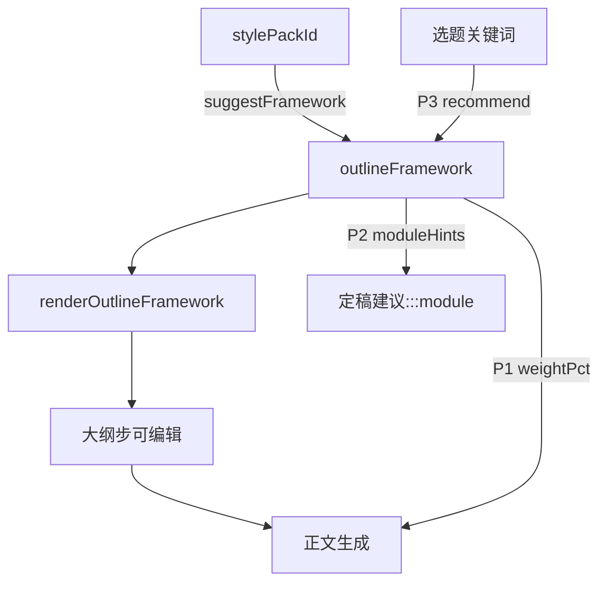

# 写作助手 · 大纲结构框架增强

> **版本**: 1.0.1  
> **日期**: 2026-07-16  
> **状态**: 已实现（P0–P3）  
> **关联**: [AI 写作小助手](./2026-07-15-ai-writing-assistant-design.md)、[风格包](./2026-07-16-wa-style-packs-design.md)、微信导出 `:::module`（`src/services/wechatExport/`）

### 实现进度

| 分期 | 状态 |
|------|------|
| P0 风格向框架 + 软建议 | **已实现** |
| P1 字数比例预算 | **已实现** |
| P2 :::module 建议 | **已实现**（定稿步可复制；`callout` 映射为现有 `golden`） |
| P3 选题关键词推荐 | **已实现** |

---

## 1. 目标

在**保留狸知「框架与风格解耦 + 可编辑骨架 + stale」**优势的前提下，吸收 md-wechat-editor 中「风格向结构模板」与「比例/字数预算」的落地实践，并分期补齐组件排版建议与选题驱动推荐。

理想形态：

> 狸知框架引擎 + 风格向骨架模板 + 字数预算 +（可选）`:::module` 建议 + 动态推荐

### 1.1 成功标准（全分期完成后）

1. 框架库在现有 6 种通用框架之上，新增至少 3 种风格向框架（爆款 / 反常识 / 情感共鸣），均可在配置 UI 点选并预填可编辑骨架。
2. 选择写作风格包时，系统给出「建议框架」并可一键应用；**不强制**覆盖用户已有大纲。
3. 骨架节可携带字数比例；正文生成 prompt 注入各节预算。
4. 定稿步可按框架展示 `:::module` 排列建议（可复制），不自动改写正文。
5. 选题采用后可按关键词规则推荐框架（无额外 LLM 调用）。

### 1.2 非目标（本 spec 明确延期）

| 项 | 说明 |
|----|------|
| 框架嵌套 | 一级框架内嵌二级框架（如总分总内嵌 howto） |
| 大纲 bullet → 正文段落追溯 | 双向映射 / 高亮对齐 |
| 范文骨架提取 | 粘贴文章自动生成框架模板 |
| 把风格包内结构「吞并」进框架 | 风格规范仍完整注入正文；框架只负责可见骨架 |
| 定稿自动插入 :::module | 仅建议与复制，不静默改写 |

---

## 2. 现状与差距

### 2.1 狸知（已实现）

实现位置：[`src/utils/writingAssistant/outlineFrameworks.ts`](../../src/utils/writingAssistant/outlineFrameworks.ts)。

| 能力 | 说明 |
|------|------|
| 多种框架 × Markdown 多级标题骨架 | 可编辑预填骨架（`##`/`###`/`####`） |
| 可见可编辑 | `renderOutlineFramework` 预填；用户改标题后再「生成」充实 |
| 空检测 | `isOutlineEffectivelyEmpty`；切换框架时若为空则套用 |
| stale | 改选题/大纲 → 下游标 stale |
| 与风格解耦 | `outlineFramework` 与 `stylePackId` 独立配置 |

现有框架偏「学术/通用」：`general`、`problemSolution`、`howto`、`storyCase`、`comparison`、`listicle`。缺少面向爆款钩子链、反常识比例、强情感弧线的专属骨架。

### 2.2 md-wechat-editor（对照）

结构写在风格文件内（与风格耦合）：爆款 8 步、清单 Why-What-How、认知颠覆 20/60/20、故事情感弧等。用户不可见、不可编辑骨架；无 stale。另有组件级 examples（`:::hero` → `:::steps` → `:::callout`）。

### 2.3 结论

狸知领先在**管理层与可控性**；短板在**风格向骨架精度**与**比例预算**。本设计用「软绑定建议」连接风格与框架，而不是把结构写死进风格包。

---

## 3. 目标架构



| 组件 | 职责 |
|------|------|
| 风格包 | 语气/句式/金句规范（已实现，见风格包 spec） |
| 框架 | 章节骨架 +（P1）比例 +（P2）组件提示 |
| 软绑定表 | `stylePackId` → 建议 `outlineFramework` |
| 关键词表 | 选题文本 → 建议框架（P3，可覆盖软绑定） |

---

## 4. 数据模型（规划）

### 4.1 节定义扩展

```ts
/** 大纲结构框架节（扩展） */
export type OutlineSection = {
  title: string;
  bullets?: string[];
  /** 占全文目标字数的比例，0–100；同框架之和宜为 100 */
  weightPct?: number;
  /** 建议的微信 :::module 类型，如 steps / compare / callout */
  moduleHint?: string;
};
```

渲染规则（P1）：若存在 `weightPct`，在对应 bullet 区追加一行提示，例如 `- （建议约占全文 15%）`，不改变原有 title/bullets 语义。

### 4.2 框架 id 扩展

在现有 `WaOutlineFramework` 上增加：

| id | 中文标签 | 用途 |
|----|----------|------|
| `viral` | 爆款钩子链 | 高传播科普 / 概念讲解 |
| `contrarian` | 反常识论证 | 认知颠覆 / 观点文 |
| `emotional` | 情感共鸣弧 | 人物故事 / 共鸣向 |

保留原 6 种不变。配置 UI 卡片分区：**通用**（6）与 **风格向**（3），或同一网格按 `order` 排列、风格向排在后段。

### 4.3 软绑定表

```ts
/** 风格包 → 建议框架（用户可改；非强制） */
export const WA_STYLE_FRAMEWORK_SUGGESTIONS: Record<string, WaOutlineFramework> = {
  default: "howto",
  viral: "viral",
  checklist: "listicle",
  resourceRoundup: "listicle",
  toolReview: "howto",
  contrarian: "contrarian",
  identity: "emotional",
  storyEmotional: "emotional",
  personalEssay: "storyCase",
};
```

未出现在表中的自定义风格包：不提示，或回退 `general`。

### 4.4 应用建议时的行为（统一约定）

| 大纲状态 | 「应用建议框架」行为 |
|----------|----------------------|
| 空 / 仅骨架注释（`isOutlineEffectivelyEmpty` 或含 `<!-- 框架` / `<!-- 预设结构`） | 写入 `outlineFramework` 并立刻 `renderOutlineFramework` |
| 已有实质内容 | 仅更新 `outlineFramework` 配置值；**不**覆盖草稿；横幅提示「大纲已有内容，请手动「套用框架」或清空后重套」 |

选风格时：若建议框架 ≠ 当前框架，显示内联横幅（非阻塞 toast）：「当前风格建议使用「xxx」框架」+ 按钮「应用建议」。

---

## 5. 分期

### P0 — 风格向框架 + 软建议（优先实现）

**范围**

1. 实现 `viral` / `contrarian` / `emotional` 三套 `OutlineSection[]`（见 §6）。
2. 更新 `WaOutlineFramework` 联合类型、`WA_OUTLINE_FRAMEWORK_*` 标签/提示、`WA_OUTLINE_FRAMEWORK_ORDER`。
3. 配置面板：风格卡选中后展示建议横幅 +「应用建议」。
4. 单元测试：新框架 × 4 格式均可渲染；软绑定表覆盖 9 个内置风格 id。

**验收**

- 配置中可见 9 种框架（6+3）；选「高流量/爆款」出现建议「爆款钩子链」。
- 空大纲点「应用建议」后编辑区变为 viral 骨架；有内容时不静默覆盖。

**不包含**：`weightPct`、module 建议、关键词推荐。

---

### P1 — 字数 / 比例预算

**范围**

1. 为全部框架（含原 6 + 新 3）补齐 `weightPct`（每框架合计 100±2，允许四舍五入差 1）。
2. `renderOutlineFramework` 展示比例提示行。
3. `buildBodyMessages`：根据 `WA_LENGTH_WORD_TARGET[length]` × `weightPct/100` 生成「各节字数预算」列表注入 user prompt。
4. `contrarian` 骨架 bullets 中显式体现 Problem≈20% / Solution≈60% / CTA≈20% 的叙事比例说明（与 `weightPct` 对齐）。

**验收**

- 正文生成请求中含各 `##` 节的约计字数。
- 骨架预览可见比例文案。

---

### P2 — `:::module` 排列建议

**范围**

1. 框架级默认 `moduleHint` 序列（整篇建议顺序），以及可选节级 `moduleHint`。
2. 定稿步（`WaStepFinalize`）增加「排版组件建议」折叠区：列出建议模块 +「复制片段」（从 `moduleSnippets` 取模板，占位符用大纲标题填充）。
3. **不**自动改写定稿 Markdown。

**框架 → 建议序列（默认）**

| 框架 | 建议模块序列（摘要） |
|------|----------------------|
| howto | hero → steps → callout → faq |
| comparison | lead → compare → summary |
| listicle | hero → cards / steps → summary |
| viral | hero → lead → callout（金句）→ summary |
| contrarian | lead → myth-fact 或 callout → summary |
| emotional | hero → lead → callout → summary |
| general / problemSolution / storyCase | hero → summary（轻量） |

具体 snippet id 以实现时 `moduleSnippets` 现有 id 为准；若某 id 不存在则降级为纯 Markdown 注释建议。

**验收**

- 定稿步可见建议；复制后粘贴到编辑器可被微信导出解析（若用户选用对应主题/布局模式）。

---

### P3 — 选题关键词动态推荐

**范围**

1. 规则表：`{ keywords: string[]; framework: WaOutlineFramework; priority: number }[]`（中文关键词，大小写不敏感）。
2. 选题「采用」后计算推荐；若与当前框架不同，大纲步或配置区展示「根据选题更建议 xxx」。
3. 优先级：关键词推荐 > 风格软绑定 > 用户当前值（仅提示，不自动改）。
4. **不**调用 LLM 做推荐（本阶段）。

**示例规则**

| 关键词（任一命中） | 建议框架 |
|--------------------|----------|
| 对比、评测、vs、哪个好 | comparison |
| 步骤、教程、怎么做、上手 | howto |
| 清单、盘点、合集、推荐 | listicle |
| 其实、误区、真相、颠覆 | contrarian |
| 故事、经历、我曾、逆袭 | emotional |
| 爆款、刷屏、全网 | viral |

**验收**

- 选题含「对比评测」时出现 comparison 建议；用户可忽略。

---

## 6. P0 骨架明细（实现照抄）

### 6.1 `viral`（爆款钩子链）

| # | title | bullets |
|---|-------|---------|
| 1 | 钩子：你一定见过… | 共鸣场景；一句话抓住注意力 |
| 2 | 数据 / 现象：这事有多火 | 具体数字或时间线；可信来源感 |
| 3 | 痛点：大部分人其实还不懂 | 常见误解；读者卡点 |
| 4 | 承诺：今天用人话讲明白 | 本文收益；阅读路径预告 |
| 5 | 比喻展开：先给结论再类比 | 一级比喻；展开类比；金句收束 |
| 6 | 反驳误解：我知道有人会说… | 预判质疑；正面回应差别 |
| 7 | 场景举例：和你有什么关系 | 2–3 类读者场景；可行动切口 |
| 8 | 升华与号召 | 关系/认知升级；今天就能做的一步 |

### 6.2 `contrarian`（反常识论证）

比例意图：开篇冲突 ≈20%（节 1–2）、论证 ≈60%（节 3–5）、行动 ≈20%（节 6）。

| # | title | bullets |
|---|-------|---------|
| 1 | 大胆陈述：反常识结论 | 一句颠覆观点；避免人身攻击 |
| 2 | 意外数据 / 现象 | 数字或反差事实；制造「为什么」 |
| 3 | 大众错在哪 | 常见信念；错因分层 |
| 4 | 真相逻辑 | 推演链条；证据类型 |
| 5 | 案例佐证 | 人物/公司/事件；可迁移点 |
| 6 | 行动与讨论 | 读者可怎么做；邀请评论区讨论 |

### 6.3 `emotional`（情感共鸣弧）

| # | title | bullets |
|---|-------|---------|
| 1 | 人物出场 | 身份锚定；日常细节 |
| 2 | 冲突 / 困境 | 情绪词；具体数字或场景 |
| 3 | 转折 | 契机；关键决定或遇见 |
| 4 | 洞察 | 顿悟金句；可迁移结论 |
| 5 | 呼应读者 | 回到「你」；轻行动号召；留白 |

---

## 7. 与风格包、写作助手主 spec 的边界

| 关注点 | 风格包 spec | 本 spec |
|--------|-------------|---------|
| 语气、句式、结尾语 | 主责 | 不重复维护 |
| 章节骨架 | 不负责 | 主责 |
| 选风格是否改框架 | 仅提供 id | 软绑定 + UI 建议 |
| 去 AI 味 / RAG / 配图 | 写作助手主流程 | 不改动 |

写作助手主流程步骤顺序不变；本增强只扩展配置与大纲/正文/定稿的提示信息。

---

## 8. 实现入口文件（供后续 writing-plans）

| 文件 | 改动分期 |
|------|----------|
| [`src/types/writingAssistant.ts`](../../src/types/writingAssistant.ts) | P0 扩展 `WaOutlineFramework` |
| [`src/utils/writingAssistant/outlineFrameworks.ts`](../../src/utils/writingAssistant/outlineFrameworks.ts) | P0–P2 骨架与渲染 |
| [`src/utils/writingAssistant/defaults.ts`](../../src/utils/writingAssistant/defaults.ts) | P0 标签/提示；P0 软绑定表可同文件或旁路 `styleFrameworkMap.ts` |
| [`src/components/writingAssistant/WaConfigPanel.vue`](../../src/components/writingAssistant/WaConfigPanel.vue) | P0 建议横幅 |
| [`src/stores/writingAssistant.ts`](../../src/stores/writingAssistant.ts) | P0 应用建议；P3 选题后推荐 |
| [`src/services/writingAssistantService.ts`](../../src/services/writingAssistantService.ts) | P1 字数预算注入 |
| [`src/components/writingAssistant/WaStepFinalize.vue`](../../src/components/writingAssistant/WaStepFinalize.vue) | P2 组件建议 |
| [`src/utils/writingAssistant/outlineFrameworks.test.ts`](../../src/utils/writingAssistant/outlineFrameworks.test.ts) | 各期单测 |

---

## 9. 验收总表

| 分期 | 验收要点 |
|------|----------|
| P0 | 9 框架可选；3 套新骨架可渲染；风格建议可一键应用且不误覆盖 |
| P1 | 比例可见；正文 prompt 含字数预算 |
| P2 | 定稿可复制 module 建议；正文不被自动改写 |
| P3 | 关键词推荐可出现、可忽略；无额外 LLM |

---

## 10. Spec 自检

- 无 TBD / 占位句；延期项集中在 §1.2。
- 框架与风格解耦立场前后一致。
- 分期边界清晰：P0 不依赖 P1+；P2 依赖微信导出已有 snippet，不阻塞 P0/P1。
- P0 骨架表足够实现照抄，无需再猜节数。
